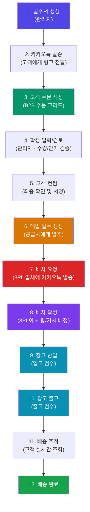
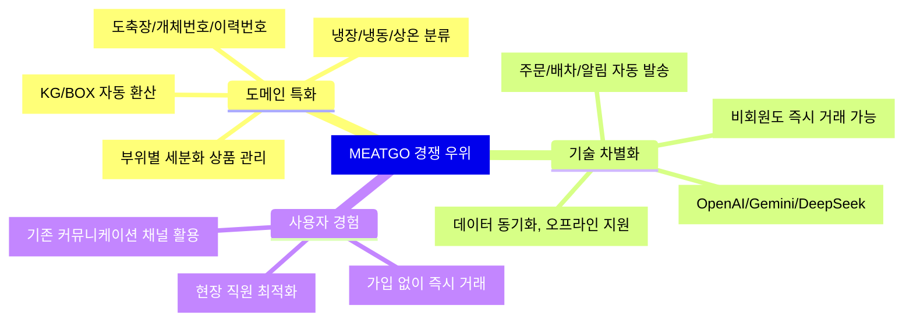
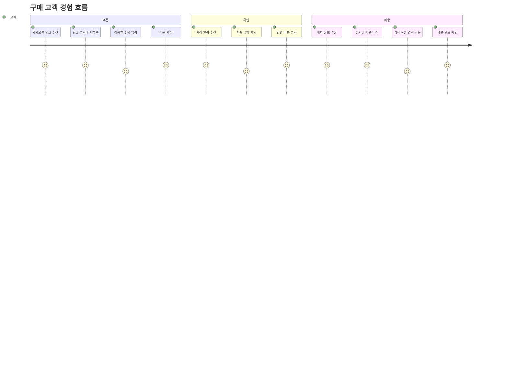
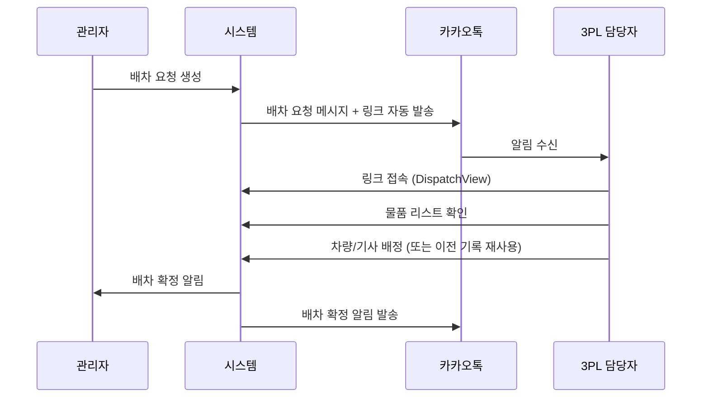
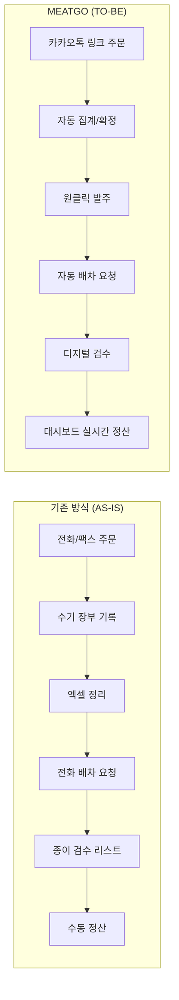

# TRS (The Real Standard) / MEATGO 시스템 브리핑 자료

---

## 1. 시스템 개요

**MEATGO(믿고)**는 육류 유통 산업에 특화된 **B2B 통합 주문-물류-정산 관리 플랫폼**입니다.
기존의 전화/팩스/카카오톡 기반 아날로그 거래를 디지털화하여, 주문 접수부터 배송 완료까지의 전 과정을 **하나의 시스템에서 실시간으로 관리**합니다.

### 핵심 가치 (Value Proposition)

| 키워드 | 설명 |
|--------|------|
| **디지털 전환** | 전화/팩스/수기 장부 -> 웹 기반 실시간 시스템 |
| **End-to-End** | 주문 -> 확정 -> 발주 -> 배차 -> 출고 -> 배송 완료까지 일원화 |
| **멀티 이해관계자** | 고객사, 공급사, 3PL 배송업체, 내부 직원 모두가 하나의 플랫폼에서 협업 |
| **AI Ready** | OpenAI/Gemini/DeepSeek 등 LLM 연동 인프라 구축 완료 |

### 사용자 역할 체계 (7개 Role)

| 역할 | 코드 | 설명 |
|------|------|------|
| 총괄 관리자 | `ADMIN` | 전체 시스템 관리, 모든 기능 접근 |
| 운영팀 | `OPS` | 주문 확정, 워크플로우 관리, 배차 조율 |
| 구매 고객 | `CUSTOMER` | 주문서 작성/제출, 배송 조회 |
| 공급사 | `SUPPLIER` | 발주서 수신, 공급 확인 |
| 회계팀 | `ACCOUNTING` | 정산, 거래내역 관리 |
| 창고팀 | `WAREHOUSE` | 반입/출고 검수 처리 |
| 3PL 배송업체 | `3PL` | 배차 요청 수신, 차량/기사 배정 |

---

## 2. 핵심 업무 프로세스 (End-to-End Workflow)

### 2-1. 전체 프로시저 흐름도

### 2-2. 단계별 상세 프로시저

#### PHASE 1: 주문 수집

| 단계 | 주체 | 행위 | 시스템 기능 |
|------|------|------|-------------|
| 1 | 관리자 | 고객별 발주서(OrderSheet) 생성 | 단가표 복사, 이전 발주서 복사, 상품 우선순위 자동 정렬 |
| 2 | 관리자 | 카카오톡으로 주문 링크 발송 | KakaoTalk Share API 연동, 토큰 기반 보안 링크 |
| 3 | 고객 | 링크 접속 후 수량/박스수 입력 | B2B 주문 그리드(모바일 최적화), 비회원 주문 가능 |
| 4 | 시스템 | 자동 중량 환산 및 금액 계산 | KG/BOX 자동 환산, 냉장/냉동/부산물 분류 |

#### PHASE 2: 주문 확정

| 단계 | 주체 | 행위 | 시스템 기능 |
|------|------|------|-------------|
| 5 | 관리자 | 제출된 주문서 검토 및 확정 입력 | 주문 검토 화면(OrderReview), 수량/단가 수정 |
| 6 | 관리자 | SalesOrder(확정 주문) 생성 | 자동 확정 주문 변환, 불변 기록 생성 |
| 7 | 고객 | 최종안 확인 (CustomerConfirm) | 고객 컨펌 페이지, 할인/메모 반영 확인 |

#### PHASE 3: 발주 및 배차

| 단계 | 주체 | 행위 | 시스템 기능 |
|------|------|------|-------------|
| 8 | 관리자 | 공급사 매입 발주서(PO) 생성 | PurchaseOrderCreate, 공급사 연동 |
| 9 | 관리자 | 3PL 배차 요청 | 카카오톡 배차 요청 메시지, 토큰 기반 배차 링크 |
| 10 | 3PL | 차량/기사 배정 | DispatchView(공개 페이지), 기사 리스트 재사용 |
| 11 | 시스템 | 배차 확정 알림 | 관리자/물류팀에 자동 알림 발송 |

#### PHASE 4: 물류 및 배송

| 단계 | 주체 | 행위 | 시스템 기능 |
|------|------|------|-------------|
| 12 | 창고팀 | 입고 검수 (반입) | WarehouseReceive, 바코드/이력번호 검수 |
| 13 | 창고팀 | 출고 검수 (출고) | WarehouseRelease, 게이트 체크리스트 |
| 14 | 고객 | 배송 실시간 추적 | DeliveryTracking, 3단계 진행 상태 표시 |
| 15 | 관리자 | 배송 완료 처리 | 상태 자동 업데이트, 대시보드 반영 |

---

## 3. 투자자 관점 분석

### 3-1. 시장 기회

| 항목 | 분석 |
|------|------|
| **대상 시장** | 국내 B2B 육류 유통 시장 (약 30조 원 규모) |
| **핵심 문제** | 전화/팩스/카카오톡 기반 비효율적 주문 처리, 수기 장부에 의한 오류, 실시간 추적 불가 |
| **진입 장벽** | 도메인 특화 지식 (육류 단위체계, 이력번호, 온도대 관리, 부분육 분류) |
| **TAM/SAM** | 전국 육류 유통업체 약 5,000개 + 식육 소매점 약 30,000개 |

### 3-2. 경쟁 우위 (Competitive Edge)

### 3-3. 비즈니스 모델 확장성

| 수익 모델 | 설명 | 잠재력 |
|-----------|------|--------|
| **SaaS 월 구독** | 거래처 수/주문 건수 기반 과금 | 높음 - 안정적 반복 매출 |
| **트랜잭션 수수료** | 주문 건당 소액 수수료 | 높음 - 거래량 비례 |
| **프리미엄 기능** | AI 분석, 가격 예측, 자동 발주 | 중간 - 대형 업체 대상 |
| **3PL 마켓플레이스** | 물류사 매칭 수수료 | 높음 - 네트워크 효과 |
| **부가 서비스** | 전자세금계산서, 정산 자동화 | 높음 - Lock-in 효과 |

### 3-4. 핵심 성과 지표 (Key Metrics)

| 지표 | 시스템에서의 추적 |
|------|-------------------|
| MAU (활성 거래처) | 대시보드 "활성 거래처" 카드 |
| 주문 완료율 | 대시보드 CONFIRMED/전체 비율 |
| 평균 처리 시간 | Operational Matrix (주문접수 -> 배송완료: 2.4일) |
| 단가표 전환율 | `reachCount` vs `conversionCount` 자동 추적 |
| 물류 처리량 | Logistics Throughput 실시간 모니터링 |

### 3-5. 기술 스택 및 인프라

| 레이어 | 기술 | 이점 |
|--------|------|------|
| **프론트엔드** | React 19 + TypeScript + Vite | 빠른 개발 사이클, 타입 안정성 |
| **백엔드/DB** | Firebase (Firestore) | 서버리스, 실시간 동기화, 자동 확장 |
| **인증** | Firebase Auth + Kakao OAuth | 소셜 로그인, 역할 기반 접근 제어 |
| **알림** | KakaoTalk Share API | 한국 사용자 95%+ 도달율 |
| **배포** | Cloudflare Pages | 글로벌 CDN, 무중단 배포 |
| **AI** | OpenAI / Gemini / DeepSeek | 멀티 LLM 대응, 비용 최적화 |
| **상태관리** | Zustand (persist) | 경량 상태 관리, 로컬 캐시 |

---

## 4. 사내 부서별 참여자 관점 분석

### 4-1. 영업/운영팀 (OPS)

| Before (AS-IS) | After (TO-BE) | 개선 효과 |
|-----------------|---------------|-----------|
| 전화로 주문 접수, 수기로 기록 | 카카오톡 링크로 주문서 발송, 자동 집계 | 주문 접수 시간 80% 단축 |
| 엑셀로 단가표 관리, 이메일 전송 | 시스템 내 단가표 생성/공유, 도달/전환율 추적 | 영업 효율 분석 가능 |
| 마감 시간 초과 주문 수동 관리 | 마감시간(cutOffAt) 자동 제한 | 야간 업무 부담 감소 |
| 고객별 히스토리 파악 어려움 | 고객별 주문 이력, 총 거래금액 자동 집계 | 데이터 기반 영업 전략 |

### 4-2. 물류팀

| Before (AS-IS) | After (TO-BE) | 개선 효과 |
|-----------------|---------------|-----------|
| 배차 전화/문자로 요청 | 카카오톡으로 자동 배차 요청 링크 발송 | 배차 요청 시간 90% 단축 |
| 3PL 기사 정보 수기 관리 | 기사/차량 자동 등록, 이전 기록 재사용 | 반복 입력 제거 |
| 출고 상황 전화 확인 | 워크플로우 대시보드에서 실시간 확인 | 현황 파악 즉시 가능 |
| 차량별 적재량 수동 계산 | 차량 타입 마스터에서 자동 매칭 | 과적/미적 방지 |

### 4-3. 창고팀 (WAREHOUSE)

| Before (AS-IS) | After (TO-BE) | 개선 효과 |
|-----------------|---------------|-----------|
| 종이 검수리스트, 수기 서명 | 디지털 체크리스트, 전자 서명 | 검수 문서 분실 방지 |
| 반입/출고 현황 사무실에 보고 | 태블릿/모바일에서 실시간 처리 | 현장 즉시 업데이트 |
| 이력번호/도축장 정보 수기 기재 | 바코드 스캔, 자동 매핑 | 이력 추적 정확도 향상 |

### 4-4. 회계팀 (ACCOUNTING)

| Before (AS-IS) | After (TO-BE) | 개선 효과 |
|-----------------|---------------|-----------|
| 거래 내역 수기 대조 | 시스템 내 자동 매칭 (Document Hub) | 정산 오류 최소화 |
| 거래명세서 종이 보관 | 전자 문서 업로드/검색/보관 | 감사 효율화 |
| 매출/매입 수동 계산 | 대시보드 실시간 매출/매입 집계 | 월말 정산 시간 70% 단축 |

### 4-5. 총괄관리자 / 임원

| Before (AS-IS) | After (TO-BE) | 개선 효과 |
|-----------------|---------------|-----------|
| 일일 보고 대기 | TRS Insights Hub 대시보드 실시간 확인 | 의사결정 속도 향상 |
| 부서간 정보 단절 | 전 부서 동일 데이터 기반 협업 | 정보 비대칭 해소 |
| 영업 성과 감에 의존 | 주문 완료율, 활성 거래처 수, 물류 처리량 데이터 | 데이터 기반 경영 |
| 직원 교육 비용 높음 | Document Hub로 매뉴얼/교육 자료 중앙 관리 | 온보딩 시간 단축 |

---

## 5. 외부 참여자별 관점 분석

### 5-1. 구매 고객 (CUSTOMER)

**핵심 이점: "카카오톡 링크 하나로 간편 주문"**

| 기능 | 고객 가치 |
|------|-----------|
| 토큰 기반 접근 | **회원 가입 없이 즉시 주문** 가능 (비회원 주문) |
| B2B 주문 그리드 | 모바일 최적화, 상품 우선순위 자동 정렬 |
| 실시간 배송 추적 | 차량번호/기사 연락처/ETA 실시간 확인 |
| 주문 이력 관리 | 과거 주문 조회, 재주문 편의성 |
| 단가표 조회 | 공유 링크로 최신 단가 즉시 확인 |
| 주문 확인 | 최종 금액/할인 확인 후 컨펌 |

### 5-2. 공급사 (SUPPLIER)

**핵심 이점: "디지털 발주서로 정확한 물량 확인"**

| 기능 | 공급사 가치 |
|------|-------------|
| 발주서 링크 수신 | 토큰 기반으로 발주서 즉시 확인 |
| 품목/수량/단가 명확 | 전화 주문 대비 오류율 대폭 감소 |
| 예상 도착일 확인 | 생산/출하 계획 수립 용이 |
| 디지털 기록 | 분쟁 시 증빙 자료로 활용 |

### 5-3. 3PL 배송업체

**핵심 이점: "카카오톡으로 배차 요청, 기사 배정 간소화"**

| 기능 | 3PL 가치 |
|------|----------|
| 배차 요청 자동 수신 | 카카오톡으로 즉시 배차 요청 확인 |
| 배송 물품 리스트 | 품목별 중량/박스수 사전 확인 |
| 기사/차량 재사용 | 이전 배차 기록에서 원클릭 선택 |
| 차량 타입 매칭 | 적재 가능 중량 자동 확인 |
| Fleet Management | 보유 차량/기사 리스트 중앙 관리 |

---

## 6. 주요 기능별 상세

### 6-1. 상품 마스터 (ProductMaster)

- B2B / B2C 채널 분리 관리
- 냉장/냉동/부산물 3대 카테고리
- 매입가(costPrice) / 도매가(wholesalePrice) 이원 가격 체계
- 도매 매출이익/이익률 자동 계산
- KG / BOX 단위 자동 환산 (boxWeight 기준)
- 가격 변동 히스토리 자동 기록 (priceHistoryService)
- 면세/과세 상품 구분

### 6-2. 단가표 관리 (PriceListManager)

- 고객별 맞춤 단가표 생성
- 카카오톡/링크를 통한 단가표 공유
- **도달수(reachCount)** 및 **전환수(conversionCount)** 자동 추적
- 견적 유효기간 설정
- 단가표에서 발주서로 직접 전환

### 6-3. 문서 허브 (Document Hub)

- WYSIWYG 리치 텍스트 에디터 (ReactQuill)
- 유튜브 영상 / 외부 웹 임베딩 지원
- 카카오톡 문서 공유 기능
- 역할 기반 비공개 카테고리 (관리자 전용)
- 댓글 시스템 (팀 내 커뮤니케이션)
- 파일 첨부/다운로드

### 6-4. AI/LLM 확장 인프라

- **3대 LLM 제공사 지원**: OpenAI, Google Gemini, DeepSeek
- 연결 테스트 기능 내장
- 활성 모델 전환 (One-click)
- 향후 활용 시나리오:
  - 주문 패턴 분석 및 수요 예측
  - 자동 발주 추천
  - 가격 트렌드 예측
  - 고객 문의 자동 응대 (Chatbot)

---

## 7. 효율성 비교 요약

| 업무 | 기존 소요 시간 | MEATGO 소요 시간 | 절감률 |
|------|---------------|------------------|--------|
| 주문 접수 및 집계 | 2~3시간/일 | 15분/일 | **87%** |
| 단가표 작성 및 배포 | 1시간/건 | 5분/건 | **92%** |
| 배차 요청 및 확정 | 30분/건 | 3분/건 | **90%** |
| 출고 검수 및 기록 | 20분/건 | 5분/건 | **75%** |
| 일일 현황 파악 | 30분+ (보고 대기) | 실시간 (대시보드) | **즉시** |
| 월말 정산 | 2~3일 | 반나절 | **70%** |

---

## 8. 개발 현황 및 로드맵

### 현재 개발 완료 (v1.0)

- [x] 주문장 전체 라이프사이클 (DRAFT -> SENT -> SUBMITTED -> CONFIRMED)
- [x] B2B 주문 그리드 (모바일 최적화)
- [x] 판매 오더(SalesOrder) 자동 생성
- [x] 매입 발주서(PurchaseOrder) 관리
- [x] 배차 관리 (Shipment + 3PL DispatchView)
- [x] 카카오톡 API 연동 (초대/주문/배차/문서 공유)
- [x] 대시보드 (매출/거래처/완료율/물류/리드타임)
- [x] 워크플로우 파이프라인 (6단계 시각화)
- [x] 창고 관리 (반입/출고 대시보드)
- [x] 배송 추적 (고객용 실시간 뷰)
- [x] 상품 마스터 (B2B/B2C 채널, 가격 히스토리)
- [x] 단가표 관리 (공유/도달/전환 추적)
- [x] 조직 마스터 (고객사/공급사/배송업체)
- [x] 사용자 관리 (역할 기반 접근 제어)
- [x] 문서 허브 (WYSIWYG, 유튜브, 댓글, 첨부)
- [x] LLM API 설정 (OpenAI/Gemini/DeepSeek)
- [x] 시스템 설정 (카카오, 테마, 기본값)
- [x] 랜딩 페이지
- [x] Firebase Auth + Kakao 소셜 로그인

### 예정 로드맵

- [ ] 회계/정산 모듈 (ACCOUNTING 역할 전용 화면)
- [ ] 전자세금계산서 자동 발행 연동
- [ ] AI 기반 수요 예측 및 자동 발주 추천
- [ ] 가격 트렌드 분석 및 시각화
- [ ] Push 알림 (FCM) 연동
- [ ] GPS 기반 실시간 배송 위치 추적
- [ ] 정산 대사 자동화
- [ ] B2C 온라인 쇼핑몰 연동

---

## 9. 투자 관점 핵심 요약

### Why MEATGO?

1. **거대 시장, 낮은 디지털화율**: 30조 원 규모의 국내 육류 유통 시장에서 디지털 전환율은 5% 미만
2. **도메인 특화 진입 장벽**: 육류 고유의 단위 체계, 이력 추적, 온도대 관리 등은 범용 ERP로 대체 불가
3. **네트워크 효과**: 고객사-공급사-3PL이 하나의 플랫폼에 연결될수록 이탈 비용 증가
4. **KakaoTalk 네이티브 연동**: 별도 앱 설치 없이 기존 메신저를 통한 즉시 온보딩
5. **AI 확장 인프라 확보**: LLM 멀티 모델 지원으로 향후 수요 예측/자동 발주 등 프리미엄 서비스 확장 가능
6. **서버리스 아키텍처**: Firebase 기반으로 인프라 비용 최소화, 사용량 비례 과금

---

*이 문서는 TRS/MEATGO 시스템의 실제 코드베이스 분석을 기반으로 작성되었습니다.*
*Date: 2026-03-12*
